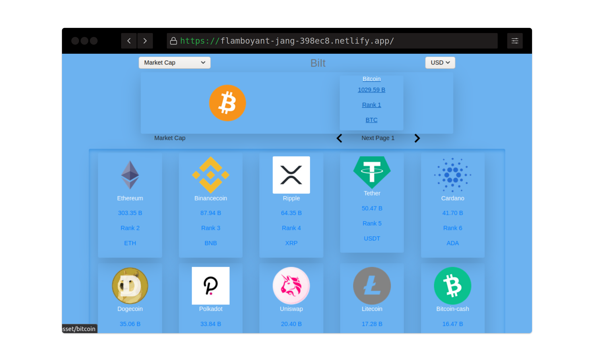

# Project: BiIt

> This project was bootstrapped with [Create React App](https://github.com/facebook/create-react-app), along with the redux template.

In this project, I developed a frontend web application, catalogue of financial values using [Stock API](https://api.coingecko.com/en/api) and insert the data to my React/Redux Application.

<p align='center' class='d-flex'>
    <span align="">
    
  </span>
</p>

The application features includes:

- List of Market capitalization, Circulating supply and 24hour exchange categories
- Filter between those 3
- Open individual stock item
- Dynamic routes for individual stock item

## Live Version

To try the live demo [click here](https://rcalculatorr.herokuapp.com/)

## About The Project

> React - Calculator is a practice project, Built with React, JavaScript, CSS3. The use of class and functional components, state management, passing props have all been applied in the project.

## Installation

> Make sure Node.js is running on your local machine

To use this app locally, this is what you need to:

- [Download](https://github.com/mke2111/statistics-catalogue.git) or clone this repo:

  - Clone with HTTPS in the terminal.

  ```
    git clone https://github.com/mke2111/statistics-catalogue.git

  ```

- Then `cd stat-catalogue` into the downloaded folder and run `npm install`
- then, run `npm run start`.

### Built With

This project was built using these technologies.

- React
- Redux
- JavaScript
- CSS3
- Netlify ( For deployment)

## Author

👤 **Roy Mukuye**

- GitHub: [@mke2111](https://github.com/mke2111)
- Twitter: [@Roymkenya](https://twitter.com/Roymkenya)
- LinkedIn: [Roy Mukuye](https://www.linkedin.com/in/roy-mukuye-42b07b1b4)

<!-- ACKNOWLEDGEMENTS -->

## Acknowledgements

- [Microverse](https://www.microverse.org/)
- [Facebook - React](https://github.com/facebook/create-react-app)

## 📝 License

This project is [MIT](https://opensource.org/licenses/MIT) licensed.
